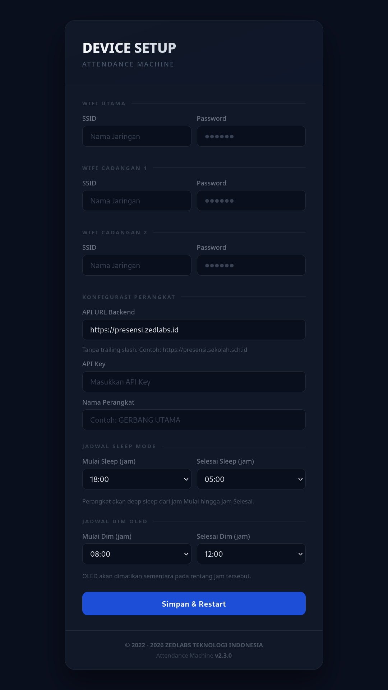

# Attendance Machine

**Attendance Machine** adalah solusi presensi berbasis _Internet of Things_ (IoT) untuk lingkungan dengan jaringan yang tidak stabil. Dibangun di atas ESP32-C3, sistem ini memakai arsitektur _hybrid_: presensi tetap tercatat saat offline (antrean di SD card atau buffer NVS) lalu dikirim ke server begitu koneksi kembali.

Versi dokumen ini mengacu pada firmware **v2.3.6**.

---



---

## Requirements & Library
- ESP32-C3 Super Mini (board profile Arduino: `ESP32C3 Dev Module`)
- Module RFID Reader (MFRC522)
- Buzzer pasif
- OLED 0.96" (Adafruit SSD1306 + Adafruit GFX Library)
- Module SD Card (SdFat)
- Module 4056 (charger baterai) + baterai
- RTC DS3231 / DS1307 (**opsional**, sangat disarankan untuk lokasi dengan WiFi tidak stabil)
- ArduinoJson 7.4.3, Adafruit BusIO 1.17.4

### Pin

| Fungsi | GPIO |
|---|---|
| SPI SCK / MOSI / MISO | 4 / 6 / 5 |
| RFID SS / RST | 7 / 3 |
| SD CS | 1 |
| OLED SDA / SCL | 8 / 9 |
| Buzzer | 10 |
| Tombol BOOT (factory reset) | 0 |

RTC (opsional) memakai bus I2C yang sama dengan OLED (GPIO 8/9), alamat `0x68`. RC522 dan SD card berbagi bus SPI.

## Environment Tools

| Item | Keterangan |
|---|---|
| Tools | Arduino IDE 2.3.6 / arduino-cli |
| Board package | esp32 (Espressif) 3.3.12 |
| Partition scheme | Minimal SPIFFS (1.9MB APP with OTA/128KB SPIFFS) |
| Author | Yahya Zulfikri |
| Version | v2.3.6 |
| Backend | Laravel 11 + Filament 3 (PHP 8.4), di belakang Cloudflare proxy |

> Warning kompilasi dari library (`#warning File not defined because __has_include(FS.h)`, `"FILE_READ" redefined`, `"FILE_WRITE" redefined`) berasal dari tabrakan makro SdFat dan `FS.h` (ditarik `WebServer.h`). Kode firmware tidak memakai makro itu, jadi aman diabaikan.

> **Aturan penempatan kode:** fungsi `verifyRollbackLater()` harus tetap berada **setelah** semua `enum` dan `struct`. Fungsi pertama di file memicu `arduino-cli` menyisipkan prototipe otomatis sebelum tipe terdefinisi, sehingga build gagal. Variabel baru sebaiknya memakai tipe dasar (mis. `uint8_t`), bukan struct baru di atas titik itu.

---

## Arsitektur Task / Concurrency

Firmware berjalan di FreeRTOS dengan 1 loop utama + 3 task. ESP32-C3 hanya punya satu core, jadi semua task berbagi core yang sama dan saling menyela lewat preemption.

| Task | Fungsi | Prioritas | Stack |
|---|---|---|---|
| `loop()` (main) | Polling RC522 (di bawah mutex SD) → masukkan ke queue, cek jadwal sleep, trigger deep sleep | – | – |
| `taskRfid` | Proses antrean scan (debounce, validasi, simpan/kirim presensi) | 3 | 8192 |
| `taskSync` | Reconnect WiFi, health check SD, OTA, RFID DB, sync data, telemetry, remote config, resync waktu | 2 | 8192 |
| `taskDisplay` | Update OLED, jadwal dim, factory reset | 1 | 12288 |

**Sinkronisasi:**
- `loop()` → `taskRfid`: FreeRTOS Queue (`xRfidQueue`), pola producer-consumer.
- Mutex: `xSdMutex` (SD **dan** bus SPI bersama RC522), `xDisplayMutex` (OLED **dan** bus I2C bersama RTC), `xConfigMutex`, `xNvsMutex` (objek `Preferences` global), `xCacheMutex` (cache RFID).
- Urutan kunci: `xSdMutex` dulu, baru `xCacheMutex`. Fungsi lookup RFID tidak mengambil mutex SD.
- Setiap request HTTPS membuat `WiFiClientSecure` sendiri, sehingga sesi TLS antar task tidak saling merusak.

---

## Keamanan Data / Kredensial

Kredensial (SSID, password WiFi ×3, API Key, API URL, nama device) disimpan terenkripsi di NVS, bukan plaintext. Alurnya:

1. **Key derivation**: key AES-128 diturunkan dari MAC address + salt tetap, di-hash SHA-256 (`deriveAesKey`).
2. **Enkripsi**: AES-128-CBC dengan IV acak per record. Format blob: IV 16 byte + data 96 byte + panjang 1 byte. Blob format lama (65 byte) masih bisa dibaca, jadi device lama tidak minta provisioning ulang.
3. **Dekripsi**: hanya ke RAM saat dibutuhkan.

Batas panjang input: SSID 32, password WiFi 63, API Key 95, API URL 79, nama device 19 karakter. Input melebihi batas ditolak form dengan pesan jelas.

> ⚠️ **Batasan enkripsi.** Salt ada di source code, MAC bukan rahasia, dan AES-CBC tanpa autentikasi. Ini melindungi dari pembacaan sekilas, **bukan** dari penyerang yang punya dump flash dan source code. Untuk perlindungan sungguhan, aktifkan flash encryption + NVS encryption ESP-IDF.

- WiFi memakai `WiFi.persistent(false)`: kredensial WiFi tidak disimpan driver di `nvs.net80211`, hanya di NVS terenkripsi aplikasi.
- Factory reset memanggil `esp_wifi_restore()` untuk menghapus sisa kredensial driver dari firmware lama.

### TLS
- Semua request HTTPS memverifikasi sertifikat dengan root CA yang tertanam (`TLS_ROOT_CA`: GTS Root R4 dan ISRG Root X1), dikendalikan `TLS_VERIFY_CERT`.
- Jika backend pindah ke CA lain, perbarui `TLS_ROOT_CA`, jika tidak semua request akan gagal.
- Verifikasi sertifikat bergantung pada jam sistem. Saat boot, NTP (UDP) dijalankan **sebelum** `pingAPI()` (HTTPS), jadi handshake umumnya sudah punya jam valid. Kasus "WiFi hidup tetapi NTP diblok" masih perlu diuji di lapangan.

---

## Logika Bisnis

### 1. Provisioning
Saat boot, device mengecek flag `prov` di NVS. Jika belum diprovisioning (atau kredensial WiFi/API key kosong):
- Device masuk mode AP bernama `ATTENDANCE MACHINE`. Password AP **acak 10 karakter, dibuat baru setiap masuk mode setup, dan ditampilkan di OLED** (tidak diturunkan dari MAC).
- DNS Server (captive portal) + Web Server (port 80) berjalan bersamaan agar browser diarahkan ke halaman setup.
- Pengguna mengisi form: SSID ×3, API URL, API Key, nama device, jadwal sleep dan dim.
- Timeout mode provisioning: 5 menit (`PROVISIONING_TIMEOUT_MS`), lalu device restart.

**Validasi `POST /save`** (gagal = HTTP 400 dengan pesan):
- SSID 1, API Key, API URL wajib diisi.
- API URL **wajib `https://`**, trailing slash dihapus otomatis, maksimum 79 karakter.
- SSID ≤ 32, password WiFi ≤ 63, API Key ≤ 95 karakter.
- Nama device ≤ 19 karakter dan hanya huruf, angka, spasi, `-`, `_`, `.`. Nama yang melanggar **ditolak**, tidak dipotong diam-diam. Pembatasan ini mencegah koma merusak CSV antrean dan tanda kutip/backslash merusak JSON.
- Jam sleep/dim harus angka 0–23 (kosong = default). Selain itu ditolak.
- Jika enkripsi/penyimpanan kredensial gagal, form menjawab HTTP 500 dan flag `prov` tidak diset.
- Setelah tersimpan → `prov = true` → restart (2 detik).

> ⚠️ **Nama device = `deviceId`** di seluruh komunikasi dengan server. Samakan persis dengan nama yang didaftarkan admin di panel. Nama berspasi aman untuk endpoint yang mengirim `device_id` lewat JSON body, dan untuk `/config` firmware melakukan URL-encoding.

### 2. Init
- Watchdog, OLED, buzzer, mutex, queue RFID.
- Zona waktu di-set `WIB-7` di awal `setup()`, sehingga jam estimasi (tanpa NTP) juga WIB.
- Pemulihan waktu awal: RTC eksternal (jika valid), selain itu estimasi dari NVS (lihat *Sync Time*).
- Load kredensial dari NVS. `deviceId` = nama custom jika diisi, selain itu `ESP32_XXXX` dari MAC.
- Init SD card, load cache RFID dan daftar admin. Jika SD tidak ada → fallback ke buffer NVS.
- RC522 diinisialisasi **sebelum** WiFi. Jika RC522 tidak merespons, device restart.
- Setelah RC522 OK, firmware ditandai valid (`esp_ota_mark_app_valid_cancel_rollback()`). Kegagalan WiFi/NTP sesudahnya bukan alasan rollback.

### 3. Connect to WiFi & Internet
- Mencoba 3 SSID tersimpan berurutan.
- Setelah terhubung, `pingAPI()` memvalidasi konektivitas ke backend, bukan sekadar status WiFi.
- Gagal semua → lanjut **offline mode**.

**Parameter radio:** `WiFi.setTxPower(WIFI_POWER_19_5dBm)`, `WiFi.setSleep(WIFI_PS_MAX_MODEM)`, `WiFi.persistent(false)`, `WiFi.setAutoReconnect(true)` berdampingan dengan state machine reconnect manual.

`WiFi.onEvent()` mencatat reason code setiap disconnect ke serial (`[WIFI] disconnect reason=N`) untuk diagnosis.

### 4. Sync Time & Kepercayaan Waktu

Sumber waktu, berurutan:
1. **RTC eksternal** (DS1307/DS3231, opsional): bila terpasang dan valid, dipakai sebagai waktu awal saat boot tanpa perlu WiFi. RTC menyimpan UTC. Jika RTC baru dipasang atau baterainya habis, OLED menampilkan `RTC BELUM DI-SET` dan RTC diisi setelah NTP berhasil. NTP berikutnya hanya menulis RTC bila selisih > 1 detik.
2. **NTP** dari 3 server: `pool.ntp.org`, `time.google.com`, `id.pool.ntp.org`. Waktu valid terakhir disimpan di RTC memory dan NVS.
3. **Estimasi dari NVS**: `lastValidTime + elapsed`, batas umur 12 jam (`MAX_TIME_ESTIMATE_AGE`).

Semua fungsi memakai **satu sumber epoch** (`getEpochWithFallback()`), yang tidak memblokir.

**Waktu tepercaya (`isTimeTrusted()`).** Estimasi NVS setelah cold boot **tidak menghitung lama listrik mati**, sehingga jamnya bisa tertinggal hingga 12 jam. Karena itu jam hasil estimasi NVS-saja dianggap **tidak tepercaya**. Selama kondisi ini:
- Scan ditolak dengan pesan `WAKTU BELUM SYNC` (saklar `REJECT_SCAN_UNTRUSTED_TIME`; set `0` bila ingin tetap menerima scan dengan jam estimasi).
- Deep sleep tidak dijalankan.
- NTP dicoba ulang tiap **60 detik** (`UNTRUSTED_TIME_RETRY_INTERVAL`), bukan 30 menit.
- Jam di OLED tampil `--:--`.

Jam menjadi tepercaya begitu RTC valid atau NTP berhasil. Bangun dari deep sleep tidak terkena aturan ini karena durasi tidurnya diketahui.

**Retry boot:** jika waktu tetap tidak tepercaya setelah boot, device restart hingga 5 kali (`MAX_BOOT_TIME_SYNC_RETRIES`). Counter disimpan di **NVS** (`boot_retry`) agar bertahan di semua jenis reset. Setelah 5 kali, device lanjut offline, `bootTimeSyncFailed = true`, dan deep sleep dinonaktifkan sampai waktu valid. Scan tetap ditolak dan NTP terus dicoba tiap menit.

Offset WIB di-hardcode (`GMT_OFFSET_SEC = 25200`), independen dari timezone Laravel.

### 5. Health Check
- `checkSDHealth()` tiap 30 detik membaca **sektor 0 kartu** (akses nyata, bukan cache mount). Gagal 3 kali beruntun (pengecekan ulang tiap 5 detik) → `sdCardAvailable = false`, cache RFID dikosongkan, fallback ke NVS/kirim langsung. SD terdeteksi lagi → reinit dan reload tanpa restart.
- Cek sinyal (weak -85 dBm, critical -90 dBm), reconnect state machine, heartbeat tiap **120 detik**.

**Watchdog:**
- Normal 90 detik (`WDT_NORMAL_TIMEOUT_MS`), diperpanjang 180 detik saat sync/OTA (`extendWdtForSync`), dikembalikan setelahnya.
- Tiap task subscribe ke WDT dan wajib `esp_task_wdt_reset()` tiap iterasi.
- Catatan: `extendWdtForSync()` tidak berefek selama `setup()` (task belum dibuat), jadi sync saat boot memakai WDT 90 detik. Setiap operasi blocking memanggil `esp_task_wdt_reset()`, risikonya kecil tetapi belum diuji untuk backlog sangat besar.

### 6. Upload Data (Sisa Data Offline)
- **SD:** `chunkedSync()` menyinkronkan maksimum 5 file per siklus. Kuota dihitung ulang tiap siklus, jadi backlog lebih dari 5 file tetap dilanjutkan di siklus berikutnya. File antrean dicari lewat **iterasi direktori**, sehingga celah nomor file tidak membuat file tertinggal.
- **File yang sedang disync** dilepas dari writer lebih dulu (`detachFromWriterLocked`), sehingga record baru tidak ditulis ke file yang akan dihapus.
- **NVS:** `nvsSyncToServer()`. Setelah server mengonfirmasi, record yang ditulis selama HTTP berjalan digeser ke awal (`nvsCompactAfterSync`), tidak ikut terhapus.
- File dihapus hanya jika server mengonfirmasi jumlah hasil sama dengan jumlah dikirim. Respons rusak/terpotong → file tetap ada dan dicoba lagi.

### 7. OTA (Check & Update)
- Cek versi ke `/firmware/check` tiap **10 menit** (default, bisa diubah lewat remote config). `device_id` dikirim lewat JSON body.
- Syarat firmware diterima (semua wajib):
  1. MD5 32 karakter hex.
  2. URL `https://` dan **host sama dengan API** (API key tidak dikirim ke host lain).
  3. Versi server lebih baru dari firmware berjalan (semver).
  4. Versi tersebut belum pernah ditolak dalam sesi boot ini.
- Unduhan memakai HTTP/1.0 (`useHTTP10(true)`) agar chunked encoding tidak menyelipkan baris ukuran di data. Ada stall timeout 30 detik, ukuran dicocokkan bila `Content-Length` ada, dan setiap `Update.write()` diperiksa.
- Update tidak dijalankan saat ada umpan balik scan yang sedang tampil.
- **Marker versi:** firmware membawa string `FWVER:<versi>;` (`FW_MARKER`). Saat mengunduh, device memindai marker itu dan membandingkannya dengan versi dari server. Tidak ada marker / berbeda → update dibatalkan (pesan "VERSI TAK ADA" / "VERSI BEDA"), dan versi itu tidak dicoba lagi sampai reboot. Ini mencegah loop OTA tanpa henti.
- `Update.end()` memverifikasi MD5. Gagal → "MD5 SALAH".
- Sukses → restart otomatis.
- **Rollback:** sketch meng-override `verifyRollbackLater()` sehingga core Arduino tidak menandai valid otomatis. Firmware ditandai valid setelah RC522 OK (lihat *Init*). Rollback hanya bekerja jika bootloader build mendukungnya, dan **belum diuji di perangkat**.

### 8. Download Data RFID Terbaru: Protokol Sentinel `END`

Backend di belakang **Cloudflare**, yang membuang header `Content-Length` dan `Connection`, jadi `Content-Length` tidak bisa diandalkan.

**Protokol:**
- Server mengirim `ver:<versi>` di baris pertama, daftar RFID, lalu baris literal `END` di akhir.
- Firmware membaca stream per baris. `END` diterima = selesai dan sukses. Tanpa `END` (koneksi putus, server crash) = gagal: file `.tmp` dihapus, versi lokal tidak berubah, dicoba lagi pada pengecekan berikutnya.
- Stall timeout 120 detik sebagai jaring pengaman.
- Unduhan memakai HTTP/1.0 (`useHTTP10(true)`).
- **Daftar kosong yang sah** (`END` diterima, 0 kartu) bukan kegagalan: file kosong disimpan dan versi diperbarui.

**Format:**
```
ver:<versi_integer>
<rfid_10_digit_1>
<rfid_10_digit_2>
...
END
```

**Penyimpanan aman:**
- Data ditulis ke `/rfid_db.tmp`, mutex SD hanya dipegang saat menulis tiap blok (bukan selama streaming), jadi scan kartu tidak ditolak saat unduhan berjalan.
- Penggantian file aktif memakai cadangan: DB lama → `/rfid_db.bak`, `.tmp` → `/rfid_db.txt`. Jika rename gagal, DB lama dikembalikan. Jika listrik mati di tengah penggantian, `.bak` dipulihkan otomatis saat cache dimuat.
- Tiap baris divalidasi persis 10 digit numerik, baris tidak valid dilewati.

**Cache:** maksimum **5000** kartu (`RFID_CACHE_MAX`). Kartu di luar batas dibuang, dan jumlahnya ditampilkan di OLED saat boot serta dikirim di heartbeat (`rfid_db_discarded`). Cek versi DB tiap **5 menit** (`RFID_DB_CHECK_INTERVAL`).

### 9. Standby (Ready Mode)
- OLED menampilkan status online/offline, jam, jumlah antrean (SD + NVS), dan bar sinyal WiFi.
- Jam tampil `--:--` bila waktu belum tepercaya.
- Layar hanya diperbarui saat state berubah (`displayStateChanged`).

### 10. Main Loop & Sleep
- `loop()`: polling RC522 (dengan mutex SD, dilewati bila mutex sedang dipegang), cek jadwal sleep, trigger deep sleep.
- **Jendela sleep** dihitung dengan `isInWindow()`: mendukung jendela yang melewati tengah malam (default **18:00–01:00**) maupun tidak. **Mulai = Selesai berarti sleep dinonaktifkan.**
- Durasi tidur dihitung sesuai jenis jendela, dibatasi minimum 60 detik dan maksimum 12 jam. Jendela lebih dari 12 jam menghasilkan satu siklus bangun singkat di tengahnya, lalu tidur lagi.
- Sleep ditunda saat `syncState.inProgress` atau `otaInProgress`.
- Sebelum tidur: `sleepRequested = true`, tunggu task (±5 detik), flush SD, matikan OLED, `PCD_SoftPowerDown()` pada RC522, lalu `esp_deep_sleep_start()`.
- Sleep hanya berjalan bila waktu **tepercaya** dan `bootTimeSyncFailed` = false.

> ⚠️ **Pengujian remote config:** jika jendela dim berada di dalam jendela sleep, efeknya tidak akan terlihat karena device sudah deep sleep. Uji di luar jam sleep aktif.

### 11. Tapping Process [Scan RFID]
- `taskRfid` memproses queue dari `loop()`. Debounce 150 ms untuk UID yang sama.
- UID dikonversi dari 4 byte pertama (`uidToString`). Untuk kartu 7 byte, byte sisanya tidak dipakai, pastikan aturan yang sama di server.
- Bila OLED sedang dim, layar menyala saat scan dan kembali ke jadwal setelah 1,8 detik.

**Mode Admin** (`/admin_rfid.txt`, maksimum 5 UID):
- OLED menampilkan `Q:<antrean SD+NVS> SC:<scan hari ini>`.
- Mengatur flag `forceSyncRequested`. **`taskSync` yang menjalankan sync**, di siklus berikutnya tanpa menunggu interval (SD dan NVS). Status sync tidak diubah dari task lain.
- Tidak mencatat presensi. Catatan: UID MIFARE dapat dikloning dan file admin ada di SD plaintext. Risikonya terbatas pada tampilan status dan sync manual.

### 12. Validate Data
> Urutan: **validasi dulu, baru simpan/kirim.**
- Waktu harus tepercaya (lihat *Sync Time*), jika tidak → `WAKTU BELUM SYNC`.
- Jika SD ada, RFID dicek ke cache lokal. Tidak terdaftar → "RFID NONAKTIF" tanpa request ke server. Lookup menunggu cache hingga 2,5 detik (selama reload), jika masih sibuk → "CACHE SIBUK".
- Jika DB lokal **belum pernah diunduh**, scan tetap disimpan ke antrean dan server yang memvalidasi saat sync.
- Validasi jadwal (hari libur dll) di server, lewat HTTP status: `400` duplikat, `403` hari libur, `404` RFID tidak aktif.

### 13. Saving Data (SD tersedia)
- Antrean CSV (`/queue_N.csv`), maksimum 25 record per file, tiap record ber-CRC8.
- Cek duplikat pada 3 file terakhir, jendela 30 menit (`MIN_REPEAT_INTERVAL`), ditambah cek scan terakhir di NVS.
- Semua record memakai epoch dari `getEpochWithFallback()`. Filter umur (1 tahun) **hanya** diterapkan bila jam valid, dan file tidak pernah dihapus karena jam belum valid.
- Metadata (`/queue_meta.txt`) hanya ditulis saat nomor file aktif berpindah, bukan tiap scan. Jumlah antrean dihitung ulang saat boot.
- Pemindaian jumlah antrean melepas mutex SD di antara file, sehingga scan kartu tidak terblokir.

### 14. Send Data (SD tidak tersedia)
- Online: kirim langsung (`kirimLangsung`). Gagal/offline: simpan ke **buffer NVS** (maksimum 40 record), "BUFFER PENUH!" bila habis.

### 15. Bulk Send
- Data per file dikirim sebagai JSON array ke `/sync-bulk` (bukan per record).
- Respons dicek per item. Item `status: error` dicatat ke `failed_log.csv`. Saat mencapai 500 baris, log dirotasi menjadi `failed_log.old` (menimpa `.old` sebelumnya) dan log baru dimulai.

### 16. Remote Config (Server → Device)
- Polling `GET /api/presensi/config?device_id=<deviceId>` tiap 10 menit, dilewati bila sinyal lemah. `deviceId` di-URL-encode.
- Field: `sleep_start`, `sleep_end`, `oled_dim_start`, `oled_dim_end`, `sync_interval_ms`, `ota_check_interval_ms`.
- **Field yang tidak dikirim atau `null` kembali ke default firmware** pada respons 200 yang valid. Mengosongkan override di panel admin benar-benar mengembalikan default.
- Respons yang bukan objek JSON atau JSON rusak diabaikan, konfigurasi lama dipertahankan.
- Jam harus 0–23, interval minimal 5000 ms. Nilai tidak valid memakai default.
- Disimpan ke NVS **hanya bila ada perubahan** (menghindari keausan flash).
- Jendela sleep/dim dengan Mulai = Selesai diterapkan (artinya fitur nonaktif) dan dicatat di serial (`[CFG] jendela ... kosong`).

> ℹ️ **Default dim 08:00–10:00.** OLED yang dim tetap menyala saat ada scan, sehingga dampaknya kecil di jam sibuk. Untuk menonaktifkan dim secara default, samakan `OLED_DIM_START_HOUR_DEFAULT` dan `OLED_DIM_END_HOUR_DEFAULT` (mis. keduanya 8). Nilai ini juga menjadi default saat server mengirim `null`.

### 17. Backoff Polling Server
OTA check, versi RFID DB, heartbeat, dan remote config memakai **backoff eksponensial** saat server gagal merespons:
- Interval efektif = interval dasar × 2^gagal, maksimum 16× dan 1 jam (kecuali interval dasar sendiri lebih besar). Contoh heartbeat 2 menit → 4, 8, 16, 32 menit.
- Sukses mereset penghitung. WiFi yang tersambung ulang mereset semuanya. Reboot juga mereset.
- Sinyal lemah tidak dihitung sebagai kegagalan server.
- Status 401/403 (mis. API key salah) ikut memicu backoff.
- **Tidak terkena backoff:** sync antrean (`chunkedSync`, `nvsSyncToServer`, sudah punya retry sendiri) dan scan langsung, agar data presensi tidak tertunda.

---

## Kondisi Fallback / Yang Perlu Diperhatikan

| Kondisi | Penanganan |
|---|---|
| **Signal Leak** | *Weak* (-85 dBm): OTA check, RFID DB check, telemetry, remote config dilewati. *Critical* (-90 dBm): NTP sync dan `pingAPI` dilewati. |
| **Storage Leak** | `QUEUE_WARN_THRESHOLD` (48.000 file) sebagai peringatan, batas `MAX_QUEUE_FILES` (60.000). Penuh → "QUEUE PENUH!". |
| **Storage Corrupt** | Record dengan CRC tidak cocok dilewati. File tanpa record valid dihapus (kecuali file tulis aktif). |
| **Storage Not Detected** | Lihat *Health Check*: terdeteksi lewat pembacaan sektor 0, fallback ke NVS/kirim langsung, pulih otomatis. |
| **Server Down** | HTTP selain 200 → record tetap di antrean. Retry eksponensial sync (`SYNC_RETRY_DELAY_MS * 2^attempt`), maksimum 2 retry. Polling OTA/DB/heartbeat/config melambat otomatis (lihat poin 17). |
| **RFID DB Download Terputus** | Tanpa `END` → `.tmp` dihapus, versi lokal tidak berubah, dicoba lagi pada pengecekan berikutnya. DB aktif tidak tersentuh. |
| **Listrik mati saat ganti DB RFID** | `.bak` dipulihkan saat boot (lihat poin 8). |
| **Kegagalan umum** | Feedback OLED + buzzer (error 3× beep). Item gagal sync dicatat ke `failed_log.csv`. |
| **No Power** | Nomor file antrean aktif di RTC memory dan metadata SD, `lastValidTime` di-backup ke NVS. Jumlah antrean dihitung ulang dari SD saat boot. Dengan RTC eksternal, jam langsung valid tanpa WiFi. Tanpa RTC, scan ditolak sampai NTP berhasil. |
| **No WiFi** | Device tetap menerima tap (bila waktu tepercaya), data ke jalur offline. Reconnect tiap 60 detik, rotasi 3 SSID, timeout 20 detik per percobaan. |
| **No Internet** | `pingAPI()` membedakan WiFi terhubung dari backend terjangkau. |
| **No Waktu** | Presensi ditolak: `WAKTU BELUM SYNC` (estimasi NVS saja) atau `WAKTU INVALID` (tidak ada jam sama sekali / estimasi kedaluwarsa >12 jam). Boot mencoba ulang hingga 5 kali (NVS), lalu lanjut offline dan terus mencoba NTP tiap menit. Pasang RTC untuk menghindarinya. |
| **Task Hang** | Per-task watchdog → restart otomatis. |
| **WiFi Disconnect Berulang meski RSSI Kuat** | Hipotesis (belum terbukti): brownout saat TX burst, `WIFI_PS_MAX_MODEM`, tumpang tindih `setAutoReconnect`. Baca reason code di serial sebelum mengubah konfigurasi. |
| **Firmware baru bermasalah** | Jika reset sebelum titik "sehat" di `setup()` dan bootloader mendukung rollback → kembali ke versi lama. |
| **Remote Config Tidak Ter-apply** | Cek `device_id` persis sama dengan panel admin, field berada di luar jendela sleep, tunggu penuh 10 menit. |

---

## Pesan Hasil Scan (OLED)

| Pesan | Arti |
|---|---|
| `PRESENSI OK` | Terkirim langsung ke server |
| `DATA TERSIMPAN` | Disimpan ke antrean SD, dikirim saat sync |
| `BUFFER n/40` | Disimpan ke buffer NVS (tanpa SD) |
| `CUKUP SEKALI!` | Scan ganda dalam 30 menit, atau server membalas 400 |
| `RFID NONAKTIF` | Kartu tidak ada di daftar aktif (atau server 404) |
| `HARI LIBUR!` | Server menolak: hari libur (403) |
| `WAKTU BELUM SYNC` | Jam belum tepercaya (cold boot tanpa RTC/NTP) |
| `WAKTU INVALID` | Tidak ada jam sama sekali |
| `CACHE SIBUK` | Daftar RFID sedang dimuat ulang, ulangi sebentar lagi |
| `QUEUE PENUH!` / `QUEUE HAMPIR PENUH!` | Antrean SD penuh / mendekati penuh |
| `BUFFER PENUH!` | Buffer NVS penuh (40 record) |
| `SD CARD ERROR` | Gagal menulis ke SD |
| `SERVER ERR n` | Server membalas kode selain 200/400/403/404 |

---

## Fitur/Perilaku Mesin

| Fitur | Implementasi Kunci |
|---|---|
| **Provisioning** | Captive portal AP, password AP acak tampil di OLED, validasi input ketat |
| **Dim Mode** | OLED mati di jendela dim (default 08:00–10:00, `isInWindow`, mendukung lewat tengah malam), cek tiap 60 detik, menyala saat scan, bisa diubah via remote config |
| **Sleep Mode** | Deep sleep di jendela sleep (default 18:00–01:00), durasi dihitung sesuai jenis jendela (maks 12 jam), RC522 dimatikan, hanya dengan waktu tepercaya |
| **Waktu** | RTC opsional → NTP → estimasi NVS (tidak tepercaya). Scan ditolak saat belum tepercaya |
| **Retensi Data** | Record offline lebih tua dari 1 tahun dilewati, hanya bila jam valid |
| **Animasi OLED** | Startup animation, progress bar, indikator sinyal |
| **Buzzer** | success (2×), error (3×), notify (1×), startup melody |
| **Debounce** | 150 ms per UID sama |
| **Update OTA** | MD5 wajib, host URL = host API, marker versi, anti-loop, rollback bergantung bootloader |
| **Heartbeat** | POST tiap 120 detik: firmware, uptime, heap, RSSI, antrean (SD+NVS), scan hari ini, status SD, jumlah RFID DB dan yang terbuang |
| **Reconnect** | State machine IDLE → INIT → TRYING → SUCCESS/FAILED, rotasi SSID |
| **Resync Time** | Tiap 30 menit (tiap 60 detik selama jam belum tepercaya) |
| **Backoff Polling** | Eksponensial maks 16× / 1 jam untuk OTA, DB, heartbeat, config |
| **Remote Config** | Override jadwal dan interval, field kosong kembali ke default, tulis NVS hanya saat berubah |
| **Buffer NVS** | Maksimum 40 record, flush otomatis saat online |
| **Mode Admin RFID** | Status + sync manual lewat `taskSync` |
| **Download RFID DB** | Sentinel `END`, penggantian file aman dengan `.bak` |
| **Dashboard Admin (Filament)** | Status live per device, "Scan Hari Ini" dihitung dari data presensi server |

---

## Factory Reset

Tahan tombol **BOOT** (GPIO 0). Reset berjalan **setelah tombol dilepas**:

| Durasi tahan | Tampilan OLED | Hasil saat dilepas |
|---|---|---|
| < 5 detik | `TAHAN UNTUK FACTORY RESET` | Batal, tidak terjadi apa-apa |
| 5 – 10 detik | `LEPAS = RESET` | Reset. **Antrean `queue_N.csv` tetap ada.** |
| > 10 detik | `HAPUS ANTREAN` | Reset **dan** semua `queue_N.csv` dihapus |

Yang dihapus pada reset: namespace NVS `cfg` dan `presensi`, kredensial WiFi driver, `rfid_db.txt`, `rfid_db.bak`, `queue_meta.txt`, `failed_log.csv/.old`. Setelah restart, device masuk mode provisioning.

Catatan:
- **Buffer offline NVS (`rec_N`, unit tanpa SD) selalu ikut terhapus** karena satu namespace dengan `presensi`. Kirim dulu datanya (tap kartu admin) sebelum reset.
- `/admin_rfid.txt` tidak dihapus.
- SD card yang dipindah ke device lain membawa antrean lama (`device_id` pada record tetap nama lama). Gunakan reset 10 detik bila tidak diinginkan.

---

## Data Config yang Disimpan Persisten
- API URL, API Key, nama device
- Kredensial WiFi (SSID + password, ×3 slot)
- Jadwal sleep/dim dan interval (dari form atau remote config)
- Waktu sync terakhir, versi RFID DB, buffer offline, hitungan scan harian

---

## Backend: Endpoint API (Laravel)

Semua route di bawah `/api/presensi`, dilindungi middleware `api.secret` (header `X-API-KEY`).

| Method | Path | Fungsi | Kirim `device_id` via |
|---|---|---|---|
| POST | `/` atau `/rfid` | Presensi single (online) | JSON body |
| POST | `/validate` | Validasi RFID | – |
| GET | `/status/{rfid}` | Status presensi hari ini | – |
| GET | `/jadwal` | Jadwal presensi hari ini | – |
| POST | `/sync-bulk` | Upload batch offline (SD/NVS) | JSON body (per item) |
| GET | `/health` | Status DB dan cache server | – |
| GET | `/ping` | Konektivitas dasar | – |
| GET | `/rfid-list` | Daftar RFID valid (sentinel `END`) | – |
| GET | `/rfid-list/version` | Versi RFID DB terbaru | – |
| POST | `/heartbeat` | Telemetry (120 detik) | JSON body |
| GET | `/config` | Override remote config | **Query string** ⚠️ |
| POST | `/firmware/check` | Cek versi firmware | JSON body |
| GET | `/firmware/download/{filename}` | Unduh firmware OTA | – |

**Kontrak `/firmware/check`:** `{ "update": true, "version": "x.y.z", "url": "https://<host API>/...", "md5": "<32 hex>" }`. `version` harus **persis sama** dengan `FIRMWARE_VERSION` di binary yang diunggah.

**Kontrak `/sync-bulk`:** jumlah elemen `data` pada respons harus sama dengan jumlah yang dikirim, jika tidak firmware menganggap respons tidak valid dan tidak menghapus antrean. Server sebaiknya menolak record duplikat dengan status jelas, karena record dapat terkirim ulang bila respons terputus.

**Kontrak `/config`:** objek JSON dengan field `sleep_start`, `sleep_end`, `oled_dim_start`, `oled_dim_end`, `sync_interval_ms`, `ota_check_interval_ms`. Field kosong/`null` kembali ke default firmware.

## Backend: Dashboard Admin (`PresensiDeviceResource`)

Panel Filament `Mesin Presensi` (`app/Filament/Resources/PresensiDeviceResource.php`):
- **Monitoring**: online (berdasarkan `last_seen_at` < 10 menit; dengan heartbeat 120 detik ini memberi toleransi 5 siklus), RSSI berwarna, status SD, antrean pending, RFID DB entries, free heap, uptime, IP terakhir. Poll 30 detik.
  - Saat server gagal, heartbeat device melambat (backoff, hingga 32 menit), jadi device bisa tampak offline lebih lama dari gangguan sebenarnya.
- **Scan Hari Ini**: dihitung dari tabel `presensi_pegawais`/`presensi_siswas` (filter `device_id` + tanggal), bukan angka laporan device.
- **Override Remote Config**: sleep, dim OLED, interval sync dan OTA per device. Mengosongkan field mengembalikan default firmware.
- **Filter cepat**: device online, antrean menumpuk, SD bermasalah.

### Prasyarat Data
`PresensiService::prosesPresensi()` wajib menyimpan `$deviceId` ke kolom `device_id` saat `create()`. Lupa menambahkannya ke `use` closure `DB::transaction()` membuat semua record ber-`device_id = NULL`.

---

## Rilis Firmware (OTA)

1. Naikkan `FIRMWARE_VERSION` dan komentar header di `attendance-machine.ino`.
2. Compile:
```bash
   arduino-cli compile --clean --fqbn esp32:esp32:esp32c3:CDCOnBoot=cdc,PartitionScheme=min_spiffs --export-binaries .
```
3. Pastikan marker versi ada di binary:
```bash
   strings build/esp32.esp32.esp32c3/attendance-machine.ino.bin | grep FWVER:
```
   Harus menampilkan `FWVER:<versi baru>;`. Baris `FWVER:` saja berasal dari kode pemindai, bukan marker.
4. Hitung MD5 dari file **yang sama**:
```bash
   md5sum build/esp32.esp32.esp32c3/attendance-machine.ino.bin
```
5. Unggah `.ino.bin` ke server. Isi versi persis `x.y.z` (tanpa `v` atau spasi) dan MD5.
6. Pantau serial: `[OTA] update=1 ver=...`, lalu setelah restart `[FW] FWVER:<versi>;`.

Pesan kegagalan OTA di OLED:

| Pesan | Arti |
|---|---|
| MD5 TIDAK ADA | Server tidak mengirim MD5 valid |
| VERSI TAK ADA | Marker tidak ditemukan di image |
| VERSI BEDA | Marker image berbeda dari versi server |
| MD5 SALAH | MD5 tidak cocok dengan image |
| UNDUH TERPUTUS | Koneksi putus atau stall > 30 detik |
| NO SPACE | Partisi OTA tidak cukup |

---

## Known Issues & Troubleshooting

### Unduhan RFID DB gagal terus ("UNDUH TERPUTUS")
Pastikan `/rfid-list` selalu mengirim `END` di akhir. Cloudflare membuang `Content-Length` dan `Connection`, jadi firmware bergantung pada sentinel. Jika unduhan di balik Cloudflare bermasalah setelah memakai `useHTTP10(true)`, hapus baris itu di `downloadRfidDb()` saja (OTA tidak terpengaruh).

### Scan selalu `WAKTU BELUM SYNC` / jam `--:--`
Device baru cold boot dan belum mendapat waktu dari RTC maupun NTP. Pastikan WiFi dan NTP (UDP 123) tidak diblok. Device mencoba NTP tiap 60 detik. Untuk lokasi dengan WiFi sering mati, pasang DS3231.

### Remote config tidak ter-apply
1. Cek data di database (`php artisan tinker`).
2. Cek `device_id` yang dipakai device sama persis dengan panel admin.
3. Cek field yang diuji berada di luar jendela sleep.
4. Tunggu penuh 10 menit sejak fetch terakhir (lebih lama bila server sedang gagal, karena backoff).
5. Periksa serial untuk log `[CFG]`.

### "Scan Hari Ini" selalu 0
Cek kolom `device_id` pada record presensi. Jika `null`, lihat *Prasyarat Data*.

### OTA tidak jalan
Lihat tabel pesan di *Rilis Firmware*. Penyebab tersering: `FIRMWARE_VERSION` belum dinaikkan sebelum build, atau versi di server berbeda dari marker di binary.

### Log serial
115200 baud, tag: `[FW]`, `[RTC]`, `[OTA]`, `[CFG]`, `[WIFI]`.

### Item yang belum diverifikasi di perangkat
- Rollback OTA (butuh bootloader yang mendukung, uji dengan image yang sengaja gagal di RC522).
- Perilaku `useHTTP10(true)` di balik Cloudflare untuk unduhan DB RFID (OTA sudah terbukti berhasil).
- Handshake HTTPS saat jam belum valid (NTP diblok, WiFi hidup).
- WDT saat sync backlog besar di `setup()`.
- Jam sistem bertahan saat `ESP.restart()` (OTA/retry boot), agar scan setelah restart tidak ditolak.
- Backoff polling: interval melebar saat backend mati dan pulih normal saat backend hidup atau WiFi tersambung ulang.

---

## Referensi
- **Non-blocking state machine (tick-based FSM)**: pola `ReconnectState` dan `SyncState`.
- **AES-128-CBC + SHA-256 key derivation (mbedtls)**: enkripsi kredensial.
- **FreeRTOS Task + Queue + Mutex**: arsitektur concurrency.
- **Sentinel-based stream termination**: pengganti deteksi `Content-Length`/connection-close di balik reverse proxy.
- **Exponential backoff**: polling server saat gagal.
